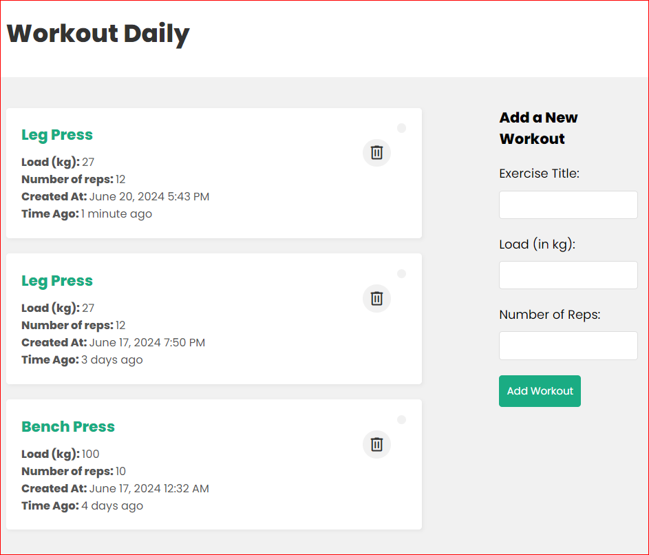

# Workout Tracker App

The Workout Tracker App is a simple yet powerful tool designed to help users manage and track their workout routines. This web application allows users to log their workouts, view the list of workouts, and delete workouts as needed.



## Features

- **Log Workouts:** Record details of each workout session, including exercises performed, duration, and date.
- **View Workouts:** See a list of all logged workouts with details.
- **Delete Workouts:** Remove unwanted workout entries from the list.

## Technologies Used

- **Frontend:** React.js, React Router DOM
- **Backend:** Node.js, Express.js
- **Database:** MongoDB (with Mongoose ODM)
- **Deployment:** Heroku (for hosting the app)

## Getting Started

To get a local copy up and running follow these simple steps.

### Prerequisites

- Node.js installed on your machine
- MongoDB installed and running locally or a MongoDB Atlas account for cloud deployment

### Installation

1. Clone the repo
   ```sh
   git clone https://github.com/yourusername/workout-tracker.git
   cd workout-tracker

2. Install NPM packages for both frontend and backend

# Navigate to frontend directory
cd frontend
npm install

# Navigate to backend directory
cd ../backend
npm install
